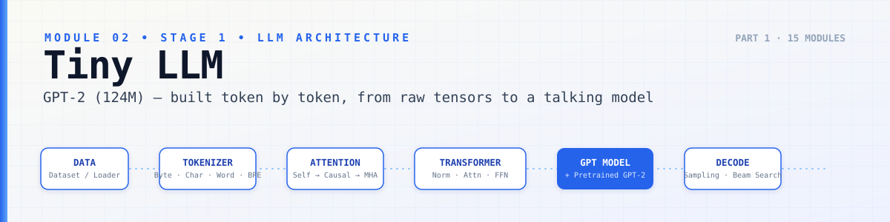
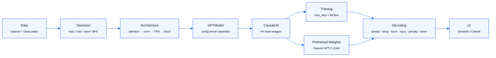

<p align="center">
  
</p>

<p align="center">
  
  
  
  
</p>

# 02 · Tiny LLM — Stage 1: LLM Architecture

> Everything needed to go from raw text on disk to a talking, sampling,
> MLflow-tracked GPT — built tensor by tensor, then loaded with OpenAI's
> real GPT-2 (124M) weights and wrapped in a UI you can actually chat with.

This module is the foundation of the whole [`llm-from-scratch`](../) series.
Nothing here imports a model class from `transformers`. Every piece —
tokenizer, attention, normalization, the transformer block, the training
loop, the decoding strategies, even the causal-LM wrapper — is written from
raw PyTorch first. HuggingFace's own GPT-2 is used only twice: as a
reference to validate architecture shape, and as the source of the
pretrained checkpoint this model eventually loads.

By the end of this module: a from-scratch GPT-2 (124M params), trained,
tracked in MLflow, tested end-to-end in notebooks, capable of loading
OpenAI's original GPT-2 weights, decoding with five different sampling
strategies plus beam search, and served through a chat UI.

---

## Pipeline



---

## Repo layout

```
02_tiny_llm/
├── model/                        # The architecture itself
│   ├── attention.py              # Self → causal → multi-head attention
│   ├── layer_norm.py             # LayerNorm from scratch
│   ├── transformer_block.py      # Attention + FFN + residuals + norm, stacked
│   ├── config.py                 # GPTConfig — typed, validated, (de)serializable
│   ├── gpt_model.py              # Full GPTModel assembly
│   ├── causal_lm.py              # HF-style CausalLM wrapper (loss + generate)
│   ├── train_step.py             # Single training step (fwd, loss, backward)
│   └── test.ipynb                # End-to-end proof the whole stack works
│
├── tokenizers/                   # Every tokenizer strategy, built up in order
│   ├── byte_tokenizer.py         # Raw byte-level tokenizer
│   ├── character_tokenizer.py    # Character-level tokenizer
│   ├── word_tokenizer.py         # Whitespace/word-level tokenizer
│   ├── bpe_tokenizer.py          # Byte-Pair Encoding, trained from scratch
│   └── tokenizers_test.ipynb     # Side-by-side comparison + vocab inspection
│
├── tests/                        # Unit tests for every component above
│   ├── test_attention_shapes.py
│   ├── test_causal_mask.py
│   ├── test_layernorm.py
│   ├── test_model.py
│   ├── test_config.py
│   ├── test_data.py
│   ├── test_tokenizer.py / test_bpe_tokenizer.py / test_train_bpe.py
│   ├── test_loss_calc.py
│   ├── test_optimizer.py
│   ├── test_generation_loop.py
│   ├── test_sampling.py
│   ├── test_serialization.py
│   ├── test_causal_lm.py
│   ├── test_nn_utils.py
│   └── adapters.py / common.py   # Shared fixtures + adapters used across tests
│
├── hyperparameter_tuning/        # Sweep configs and search results
├── learning_rate_scheuler/       # Warmup + decay schedules
├── user_interface/               # Chat with the model
│   ├── streamlit_ui.py
│   └── chainlit_ui.py
│
├── sampling.py                   # Decoding strategies as standalone functions/classes
├── generate.py                   # Generation entrypoint (wires model + sampling)
├── train.py                      # Full training script, logs to MLflow
├── finetune_classification.py    # Classification fine-tuning on top of the base model
├── load_pretrained_weight.py     # Converts + loads OpenAI's GPT-2 checkpoint
└── loading_pretrained_weight.ipynb  # Notebook proof the loaded weights generate real text
```

---

## 1 · Data — Dataset & DataLoader

A custom `torch.utils.data.Dataset` that takes raw text, tokenizes it, and
slices it into fixed-length `(input_ids, target_ids)` windows with a
configurable stride (so the model sees overlapping context, not just
disjoint chunks). Wrapped in a standard `DataLoader` for batching, shuffling,
and multi-worker loading. `tests/test_data.py` checks window lengths,
stride behavior, and target-shift-by-one correctness.

## 2 · Tokenizers

Four tokenizers, in increasing order of sophistication, all under
[`tokenizers/`](./tokenizers):

| Tokenizer | Idea | File |
|---|---|---|
| Byte-level | Every byte is a token — smallest possible vocab, no OOV | `byte_tokenizer.py` |
| Character-level | One token per character | `character_tokenizer.py` |
| Word-level | Whitespace/punctuation split | `word_tokenizer.py` |
| BPE | Learns merges from a corpus, GPT-2-style | `bpe_tokenizer.py` |

`tokenizers_test.ipynb` trains and compares all four on the same corpus —
vocab size, compression ratio, and how each handles unseen words. The BPE
tokenizer is the one used everywhere downstream (it's what makes loading
OpenAI's GPT-2 vocab possible later).

## 3 · Architecture — built up piece by piece

Inside [`model/`](./model), each file is one layer of the stack, built in
the order a transformer actually assembles:

1. **`attention.py`** — self-attention → causal (masked) attention →
   multi-head attention, each implemented as its own class so the causal
   mask and the multi-head split are visible, not hidden inside one
   monolithic `Attention` block.
2. **`layer_norm.py`** — LayerNorm from raw mean/variance ops, no
   `nn.LayerNorm`.
3. **`transformer_block.py`** — pre-norm → multi-head attention → residual
   → pre-norm → feed-forward (GELU MLP) → residual. One block, stacked
   `n_layers` times inside the full model.
4. **`config.py`** — `GPTConfig`: a typed, validated dataclass (vocab size,
   context length, embedding dim, heads, layers, dropout) with
   `from_pretrained` / `save_pretrained`, so a config can be shared between
   training, generation, and weight loading without hardcoding numbers in
   three places.
5. **`gpt_model.py`** — `GPTModel`: token + positional embeddings →
   `n_layers` × `TransformerBlock` → final norm → LM head. This is the
   124M-parameter GPT-2 architecture, assembled entirely from the pieces
   above.

`tests/test_attention_shapes.py`, `test_causal_mask.py`, and
`test_layernorm.py` check tensor shapes and masking behavior in isolation;
`test_model.py` checks the fully assembled forward pass.

## 4 · CausalLM wrapper

**`causal_lm.py`** wraps `GPTModel` the way HuggingFace's
`GPT2LMHeadModel` does: forward pass returns logits *and* loss when labels
are provided, and exposes a `.generate()` entrypoint. Reproducing that
interface from scratch — rather than importing it — is what makes it
possible to compare training loops line-for-line against the HF `Trainer`
in later modules, and what makes the pretrained-weight loading below a
drop-in swap instead of a rewrite. `tests/test_causal_lm.py` checks the
loss matches a manual cross-entropy calculation.

## 5 · Training + MLflow

**`train.py`** and **`model/train_step.py`** implement the training loop:
forward pass, cross-entropy loss (`tests/test_loss_calc.py`), backward,
optimizer step (`tests/test_optimizer.py`), with **MLflow** logging loss,
learning rate, and perplexity per step/epoch:

```bash
python train.py --config model/config.py
mlflow ui --backend-store-uri ./experiments/mlruns
```

`learning_rate_scheuler/` holds the warmup + decay schedules used during
training, and `hyperparameter_tuning/` holds sweep configs and their
results — both feeding into the runs tracked in MLflow.

`model/test.ipynb` is the single notebook that runs the entire stack
top-to-bottom on real data: tokenize → batch → forward → loss → one
training step → generate — proof that every piece above actually
integrates, not just passes its unit test in isolation.

## 6 · Loading OpenAI's pretrained GPT-2 (124M)

**`load_pretrained_weight.py`** downloads and converts OpenAI's original
GPT-2 TensorFlow checkpoint into this repo's `GPTModel` state dict —
matching shapes, transposing the Conv1D weights TF stores transposed
relative to PyTorch's `Linear`, and mapping every parameter name from the
official checkpoint to this from-scratch architecture's naming.

**`loading_pretrained_weight.ipynb`** is the proof: load the real 124M
weights into the from-scratch model and generate coherent GPT-2-quality
text — confirming the architecture in `model/` is not just shape-correct
but numerically identical to the real thing.

`tests/test_serialization.py` covers save/load round-tripping of both
trained and pretrained checkpoints.

## 7 · Decoding strategies

**`sampling.py`** implements every decoding strategy as its own function
and class, so each can be reasoned about (and unit-tested) independently
rather than living as `if/elif` branches inside one giant `generate()`:

| Strategy | What it does |
|---|---|
| **Greedy** | Always pick the highest-probability next token |
| **Temperature scaling** | Sharpen or flatten the logit distribution before sampling |
| **Top-k** | Sample only from the k highest-probability tokens |
| **Top-p (nucleus)** | Sample from the smallest set of tokens whose cumulative probability ≥ p |
| **Frequency penalty** | Down-weight tokens proportional to how often they've already appeared, to reduce repetition |
| **Beam search** | Track the top-N candidate sequences at each step instead of one, backtracking to the highest-scoring full sequence |

**`generate.py`** wires a loaded model (trained or pretrained) to any of
the above. `tests/test_generation_loop.py` and `tests/test_sampling.py`
check that each strategy produces valid, correctly-shaped, correctly
-distributed output — including edge cases like `k`/`p` at their extremes
and beam search with beam width 1 reducing to greedy.

## 8 · Fine-tuning

**`finetune_classification.py`** repurposes the pretrained/trained GPT into
a classifier: swaps the LM head for a classification head, generalized to
any N-class task rather than hardcoded to one dataset.

## 9 · Testing

Every component above has a matching test in [`tests/`](./tests), run with:

```bash
pytest -v
```

`tests/adapters.py` and `tests/common.py` hold shared fixtures so tests
across tokenizers, model internals, training, and generation reuse the same
setup instead of duplicating it. CI runs the full suite on every push.

## 10 · UI

[`user_interface/`](./user_interface) puts the model behind an actual chat
interface, so "does this work" is a conversation, not just a passing test:

```bash
streamlit run user_interface/streamlit_ui.py
# or
chainlit run user_interface/chainlit_ui.py
```

Both UIs let you pick between the trained-from-scratch checkpoint and the
loaded OpenAI GPT-2 weights, and expose the decoding strategy + its
parameters (temperature, k, p, penalty, beam width) as controls.

---

## Result

A from-scratch reimplementation of **GPT-2 124M** — architecture, training,
decoding, and pretrained-weight compatibility all verified against the
real thing — ready to be extended with RoPE/RMSNorm/GQA/MoE in
[`03_attention_variants`](../03_attention_variants) and
[`04_modern_architecture`](../04_modern_architecture).