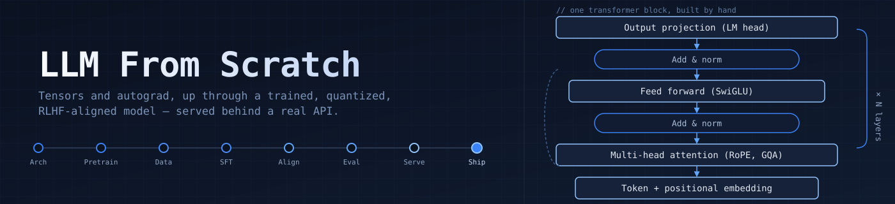
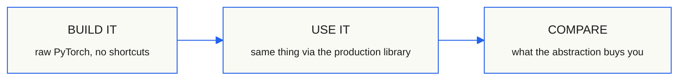
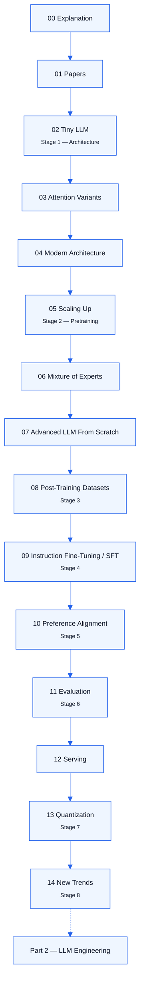

<p align="center">
  
</p>

<p align="center">
  <a href="./ROADMAP.md"></a>
  
  
  <a href="./LICENSE"></a>
</p>

> Build a large language model from first principles: tensors and autograd, up
> through a trained, quantized, RLHF-aligned model served behind a real API.
> Every stage is implemented by hand first — no `import transformers`
> shortcuts until you've built the thing you're importing — then compared
> against the production approach, so the tradeoffs are visible instead of
> assumed.

```
Attention, from scratch          ->  torch.nn.MultiheadAttention
A hand-rolled training loop      ->  HuggingFace Trainer
Manual RLHF reward loop          ->  TRL / trlx
```

This is **Part 1** of a two-part series. Part 2,
[`AI-EngineeringRoadmap`](../AI-EngineeringRoadmap), picks up once a model
exists and covers RAG, agents, inference optimization, and deployment.

---

## Why from scratch

Frameworks like HuggingFace `transformers` are the right tool for building
*products*. They're a bad tool for *understanding* — the abstraction that
makes them productive is exactly what hides how attention, KV-caching, or
DPO actually work. This repo trades that productivity for transparency: every
notebook here should leave you able to explain, not just call, the thing it
implements.



## What you'll have built by the end

- A GPT-style transformer, trained from raw tensors up — no framework model
  classes
- A modern architecture upgrade path: RoPE, RMSNorm, GQA, sliding-window
  attention, MoE
- A model that's been through the full post-training pipeline: SFT, reward
  modeling, DPO/PPO
- The same model quantized and served behind a FastAPI endpoint and a vLLM
  deployment

---

## The shape of the repo

Fifteen modules stack roughly in order. Architecture is the floor; serving
and quantization are the roof. The numbering follows the standard LLM
mastery path (architecture → pretraining → post-training → evaluation →
quantization → new trends).



Skip ahead if you already know the lower layers — but if something near the
top breaks, it's usually because a lower layer wasn't actually solid.

---

## Contents

Click a module to expand what's inside it. Full status detail — including
what's a skeleton vs. fully implemented — lives in [`ROADMAP.md`](./ROADMAP.md).

<details>
<summary><strong>00 · Explanation</strong></summary>

Conceptual write-ups: attention, normalization, the training objective — the
"why" behind what gets built in every module after this one.

</details>

<details>
<summary><strong>01 · Papers</strong></summary>

Source papers referenced throughout, with an annotated index.

</details>

<details>
<summary><strong>02 · Tiny LLM</strong> — Stage 1: LLM Architecture</summary>

First working GPT: architecture, BPE tokenizer, sampling
(temperature/top-k/top-p), training, pretrained-weight loading,
classification fine-tuning.

| Piece | What it is |
|---|---|
| Self-attention → causal attention → multi-head attention | The attention stack, built up in stages |
| `LayerNorm`, `FeedForward`, `TransformerBlock` | Core building blocks |
| `GPTModel` | Full model assembly |
| `GPTConfig` | Typed, validated config (dataclass, `from_pretrained`/`save_pretrained`) |
| Text generation loop | Greedy decoding to start, sampling strategies layered on later |
| Pretrained weight loading | Converts OpenAI's original GPT-2 TF checkpoint |
| Classification fine-tuning | Generalized to any N-class task, not just spam/ham |

</details>

<details>
<summary><strong>03 · Attention Variants</strong></summary>

Self / causal / multi-head / GQA / MQA compared side by side, with
benchmarks, comparison charts, and an interactive playground.

</details>

<details>
<summary><strong>04 · Modern Architecture</strong></summary>

RoPE, NoPE, RMSNorm, SwiGLU, KV-cache, sliding window attention, rolling
buffer cache — plus ablation notes on what each change actually bought.

</details>

<details>
<summary><strong>05 · Scaling Up</strong> — Stage 2: Pretraining Models</summary>

Mixed precision, gradient accumulation, distributed training (DDP/FSDP),
scaling law notes.

</details>

<details>
<summary><strong>06 · Mixture of Experts</strong></summary>

MoE layer, router, load-balancing loss.

</details>

<details>
<summary><strong>07 · Advanced LLM From Scratch</strong></summary>

Combines RoPE + RMSNorm + SwiGLU + GQA + KV-cache (+ optional MoE) into one
model.

</details>

<details>
<summary><strong>08 · Post-Training Datasets</strong> — Stage 3</summary>

Chat templates + loss masking, synthetic data generation, data enhancement,
quality filtering — the data prep that everything from `09` onward depends
on.

</details>

<details>
<summary><strong>09 · Instruction Fine-Tuning / SFT</strong> — Stage 4</summary>

Prompt formatting + loss masking, SFT training script, eval harness.

</details>

<details>
<summary><strong>10 · Preference Alignment</strong> — Stage 5</summary>

Reward model architecture + training, preference dataset loader, rejection
sampling, DPO, PPO trainer and rollout collection.

</details>

<details>
<summary><strong>11 · Evaluation</strong> — Stage 6</summary>

Automated benchmarks, human evaluation tooling, LLM-as-judge, feedback
signal aggregation — tracked and compared across checkpoints.

</details>

<details>
<summary><strong>12 · Serving</strong></summary>

Custom FastAPI inference server, request batching, streaming responses,
vLLM deployment, GGUF/Ollama deployment, Baseten deployment, load testing.

</details>

<details>
<summary><strong>13 · Quantization</strong> — Stage 7</summary>

Base techniques (symmetric/asymmetric, per-tensor/per-channel) from scratch,
GGUF/llama.cpp, GPTQ/AWQ, SmoothQuant/ZeroQuant.

</details>

<details>
<summary><strong>14 · New Trends</strong> — Stage 8</summary>

Model merging, multimodal extension, interpretability, test-time compute.

</details>

<details>
<summary><strong>Data Collection</strong></summary>

Public-domain book corpus (Gutenberg, Internet Archive, Wikipedia).

</details>

<details>
<summary><strong>extra/pytorch-basics</strong></summary>

PyTorch/CNN/DNN prerequisites, kept separate from the main track — start
here if tensors and `nn.Module` aren't yet second nature.

</details>

---

## Where to start

If you're comfortable with PyTorch already, start at `02_tiny_llm/`. If not,
`extra/pytorch-basics/pytorch_nn_cnn_transformer_from_scratch.ipynb` builds
tensors → autograd → DNN → CNN → transformer block by block and is the
intended on-ramp.

## Environment

```bash
python -m venv .venv && source .venv/bin/activate
pip install -r requirements.txt
```

Or via Docker:

```bash
docker build -t llm-from-scratch .
docker run --gpus all -it llm-from-scratch
```

## Experiment tracking

Training scripts log to MLflow:

```bash
mlflow ui --backend-store-uri ./experiments/mlruns
```

## Running tests

```bash
pytest -v
```

CI runs the suite on every push (see `.github/workflows/tests.yml`).

## Checkpoints

Model weights are **not** committed directly. See
[`checkpoints/README.md`](./checkpoints/README.md) for how weights are
stored and how to reproduce them.

## Contributing

Issues and PRs welcome — see [`CONTRIBUTING.md`](./CONTRIBUTING.md).
Notebooks should run top-to-bottom without manual patching; strip outputs
before committing.

## License

See [`LICENSE`](./LICENSE).
