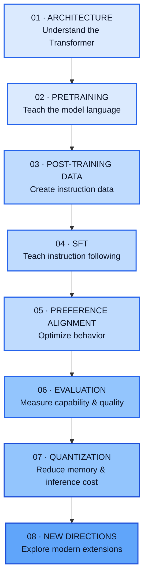
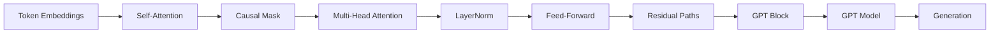

<p align="center">
  
</p>

<p align="center">
  <strong>Understand LLMs by building the machinery yourself.</strong>
</p>

<p align="center">
  A free, open-source, implementation-first course for going from tensors and tokenization
  to pretraining, modern Transformer architectures, post-training, alignment, evaluation,
  quantization, and inference.
</p>

<p align="center">
  <a href="#-the-journey">Journey</a> ·
  <a href="#-what-you-will-build">What you'll build</a> ·
  <a href="#-curriculum">Curriculum</a> ·
  <a href="#-how-to-use-this-repository">How to learn</a> ·
  <a href="#-contributing">Contributing</a>
</p>

<p align="center">
  
  
  
  
</p>

---

# LLM From Scratch

Most people meet large language models at the level of an API:

```python
response = model.generate(...)
```

That is useful.

It is not the same as understanding the model.

This repository is built around a different question:

> **What if, instead of starting with the abstraction, we built enough of the underlying system to understand why the abstraction exists?**

You will work from the inside out:

```text
Tensors
  ↓
Tokenization
  ↓
Embeddings
  ↓
Attention
  ↓
Transformer
  ↓
Language Model
  ↓
Pretraining
  ↓
Post-training
  ↓
Alignment
  ↓
Evaluation
  ↓
Quantization
  ↓
Inference & Serving
```

The objective is **not** to reproduce the largest model in the world.

The objective is to make the important ideas behind modern LLMs small enough to inspect, implement, test, break, fix, and understand.

---

## Why build an LLM from scratch?

Modern frameworks are excellent at hiding complexity.

That is exactly what makes them powerful.

But abstraction has a cost: once you call a highly optimized component, it becomes easy to forget what problem it is solving.

For example:

```text
                 PRODUCTION
                     │
          ┌──────────┴──────────┐
          │                     │
   Hugging Face             vLLM / GGUF
          │                     │
          └──────────┬──────────┘
                     │
              "It just works."
                     │
                     ▼
              ┌─────────────┐
              │  THE BLACK  │
              │    BOX      │
              └─────────────┘
```

This project deliberately opens that box.

Instead of beginning with:

```python
from transformers import AutoModelForCausalLM
```

the learning path asks you to first understand things such as:

- What exactly is a token?
- Why do we need embeddings?
- What are `Q`, `K`, and `V`?
- Why does causal masking exist?
- Why divide attention scores by `sqrt(d_k)`?
- Why do residual connections help?
- Why normalize?
- Why does the model predict the *next* token?
- What is actually optimized during pretraining?
- Why does inference need a KV cache?
- Why do modern architectures use RoPE, RMSNorm, SwiGLU and GQA?
- Why do DPO and PPO solve different optimization problems?
- What does quantization trade for memory and speed?
- What does an inference server actually have to do?

Once those questions become concrete, production libraries stop looking magical.

They become **engineering abstractions over mechanisms you understand**.

---

# 🎯 The philosophy

The repository follows one rule throughout:

> ### **Understand → Implement → Test → Compare → Optimize**

Every major idea should pass through this cycle.

### 1. Understand

Start with the intuition, equations, shapes, assumptions, and purpose.

### 2. Implement

Build the smallest useful version yourself.

No unnecessary framework magic.

### 3. Test

Check shapes, numerical behavior, edge cases, gradients, and known reference behavior.

### 4. Compare

Only then look at the mature implementation.

Ask:

> **What did the production implementation change, and why?**

### 5. Optimize

Once correctness is understood, study the engineering required to make it faster, smaller, distributed, and deployable.

This distinction is important:

```text
                LEARNING IMPLEMENTATION
                         │
                         ▼
                "Can I explain it?"
                         │
                         ▼
                "Can I implement it?"
                         │
                         ▼
                "Can I prove it works?"
                         │
                         ▼
                PRODUCTION IMPLEMENTATION
                         │
                         ▼
                "How does it scale?"
```

The repository is therefore not anti-framework.

It is **anti-black-box learning**.

---

# 🧭 The journey

The core curriculum follows the lifecycle of a language model.



These stages are connected.

A tokenizer affects the data.

The data affects pretraining.

Pretraining determines the starting point for post-training.

Post-training determines the behavior you evaluate.

Evaluation tells you whether an intervention helped.

Quantization changes how the resulting model can be served.

The entire project is therefore one continuous system rather than a collection of unrelated tutorials.

---

# 🏗️ What you will build

By working through the repository, you progressively move from individual mathematical operations to a complete language-model lifecycle.

### Foundations

```text
Tensor operations
      ↓
Autograd / neural-network fundamentals
      ↓
Text → tokens
      ↓
Tokens → embeddings
```

### Model

```text
Embeddings
    ↓
Positional information
    ↓
Attention
    ↓
Feed-forward network
    ↓
Residual connections + normalization
    ↓
Transformer blocks
    ↓
GPT-style language model
```

### Training

```text
Dataset
   ↓
Tokenization
   ↓
Context windows
   ↓
Next-token prediction
   ↓
Loss
   ↓
Backpropagation
   ↓
Optimizer
   ↓
Learning-rate schedule
   ↓
Checkpoint
```

### Post-training

```text
Pretrained model
      ↓
Instruction data
      ↓
SFT
      ↓
Preference data
      ↓
DPO / reward modeling / PPO
      ↓
Aligned model
```

### Deployment

```text
Trained model
     ↓
Evaluation
     ↓
Quantization
     ↓
Inference runtime
     ↓
API / batching / streaming
     ↓
Real application
```

The end goal is not one impressive notebook.

It is the ability to **trace the whole system**.

---

# 🔬 Curriculum

## 01 — LLM Architecture

### The question

> **What is inside a GPT-style language model?**

The first part builds the model from its smallest meaningful pieces.

### Core concepts

- tokenization
- vocabulary and token IDs
- embeddings
- positional information
- self-attention
- causal attention
- multi-head attention
- normalization
- feed-forward networks
- residual connections
- Transformer blocks
- language-model heads
- autoregressive generation
- decoding and sampling

### Architecture

```text
Input text
    │
    ▼
Tokenizer
    │
    ▼
Token IDs
    │
    ▼
Token Embeddings
    │
    ▼
Positional Information
    │
    ▼
┌──────────────────────────────┐
│       Transformer Block      │
│                              │
│   Normalization              │
│       ↓                      │
│   Multi-Head Attention       │
│       ↓                      │
│   Residual Connection        │
│       ↓                      │
│   Normalization              │
│       ↓                      │
│   Feed-Forward Network       │
│       ↓                      │
│   Residual Connection        │
└──────────────────────────────┘
              × N
    │
    ▼
Final Normalization
    │
    ▼
Language-Model Head
    │
    ▼
Logits
    │
    ▼
Sampling
    │
    ▼
Next token
```

The initial GPT implementation is intentionally small enough to read from top to bottom.

---

## 02 — Pretraining

### The question

> **How does a Transformer become a language model?**

A model architecture is only a structure.

Pretraining gives that structure useful parameters.

This section covers:

- dataset preparation
- tokenized training corpora
- context windows
- next-token prediction
- cross-entropy loss
- optimizers
- learning-rate schedules
- gradient accumulation
- mixed precision
- checkpointing
- experiment tracking
- distributed training
- DDP
- FSDP
- scaling-law reasoning
- mixture-of-experts
- routing and load balancing

The mental model becomes:

```text
Large corpus
     ↓
Clean / filter / tokenize
     ↓
Training examples
     ↓
Transformer
     ↓
Next-token loss
     ↓
Gradient computation
     ↓
Parameter update
     ↓
Repeat millions / billions of times
```

---

## 03 — Post-Training Data

### The question

> **How do we create data that teaches a pretrained model to behave usefully?**

Pretraining data teaches broad statistical structure.

Post-training data introduces a different kind of supervision.

Topics include:

- chat templates
- conversation formatting
- loss masking
- synthetic instruction generation
- self-instruct style generation
- data enhancement
- paraphrasing
- difficulty variation
- response quality filtering

The key lesson:

> **Data is part of the model.**

Changing the data distribution changes what the training process can teach the model.

---

## 04 — Supervised Fine-Tuning

### The question

> **How do we turn a pretrained language model into an instruction-following model?**

The pipeline becomes:

```text
Pretrained model
      +
Instruction / response pairs
      ↓
Supervised fine-tuning
      ↓
Instruction-following model
```

You will study:

- prompt formatting
- response formatting
- loss masking
- SFT training
- checkpointing
- evaluation integration
- fine-tuning experiments

The important distinction is between **learning language** and **learning how to respond to instructions**.

---

## 05 — Preference Alignment

### The question

> **How do we optimize a model toward preferred behavior?**

Human preference is not the same thing as next-token prediction.

This section explores the machinery introduced to bridge that gap:

- preference datasets
- reward models
- rejection sampling
- Direct Preference Optimization
- Proximal Policy Optimization
- rollout collection
- preference objectives
- PPO vs. DPO

Conceptually:

```text
Prompt
  │
  ├── Response A ──┐
  │                ├── Preference signal
  └── Response B ──┘
          │
          ▼
   Alignment objective
          │
          ▼
   Updated model
```

The objective is to understand the optimization, not simply memorize the names of alignment algorithms.

---

## 06 — Evaluation

### The question

> **How do we know whether the model actually got better?**

Evaluation is treated as part of model development, not as a final checkbox.

You will explore:

- perplexity
- multiple-choice evaluation
- automated benchmarks
- human A/B comparison
- model-based evaluation
- LLM-as-judge
- feedback signals
- checkpoint comparison

The core discipline is:

```text
Change something
      ↓
Measure it
      ↓
Compare against a baseline
      ↓
Decide whether the change helped
```

A compelling demo is evidence of possibility.

A controlled evaluation is evidence of improvement.

---

## 07 — Quantization

### The question

> **How can we make a model smaller and cheaper to run?**

Model parameters are stored numerically.

Quantization changes how those numbers are represented.

The learning path moves from the mathematics to practical systems:

```text
Floating-point weights
        ↓
Quantization parameters
        ↓
Lower-precision representation
        ↓
Less memory
        ↓
Potentially faster / cheaper inference
        ↓
Possible quality loss
```

Topics include:

- symmetric quantization
- asymmetric quantization
- per-tensor quantization
- per-channel quantization
- block-wise quantization
- GGUF
- llama.cpp
- GPTQ
- AWQ
- SmoothQuant
- ZeroQuant

The important question is always:

> **What did we gain, and what did we give up?**

---

## 08 — New Directions

The final stage is deliberately exploratory.

LLM research does not stop at one architecture.

This section provides a place to study directions such as:

- model merging
- task arithmetic
- multimodal models
- interpretability
- attention visualization
- logit lens
- test-time compute
- self-consistency
- best-of-N
- search-based inference

The goal is to develop a transferable habit:

> **When a new technique appears, understand the problem it solves before learning the name of the technique.**

---

# 🧱 Architecture progression

One of the most important ideas in this repository is that the "modern LLM" is not introduced as one giant implementation.

It is assembled progressively.



Then the architecture evolves:

```text
GPT-style baseline
       │
       ├── RoPE
       ├── RMSNorm
       ├── SwiGLU
       ├── GQA / MQA
       ├── KV-cache
       ├── Sliding-window attention
       └── MoE
              │
              ▼
       Modern LLM architecture
```

This progression makes architectural decisions measurable.

Instead of saying:

> "Llama uses RMSNorm."

you can ask:

> "What changes when RMSNorm replaces LayerNorm, and why might that be useful?"

That is a much deeper understanding.

---

# ⚙️ Data is part of the system

A language model is not just a neural network.

A useful mental model is:

```text
                 ┌──────────────┐
                 │    DATA      │
                 └──────┬───────┘
                        ↓
                 ┌──────────────┐
                 │ TOKENIZATION │
                 └──────┬───────┘
                        ↓
                 ┌──────────────┐
                 │  TRAINING    │
                 └──────┬───────┘
                        ↓
                 ┌──────────────┐
                 │    MODEL     │
                 └──────┬───────┘
                        ↓
                 ┌──────────────┐
                 │ POST-TRAINING│
                 └──────┬───────┘
                        ↓
                 ┌──────────────┐
                 │  EVALUATION  │
                 └──────┬───────┘
                        ↓
                 ┌──────────────┐
                 │   SERVING    │
                 └──────────────┘
```

That is why the repository includes a data-collection path.

The learning process should expose:

```text
Source
  ↓
Collection
  ↓
Cleaning
  ↓
Filtering
  ↓
Deduplication
  ↓
Tokenization
  ↓
Packing
  ↓
Training
```

Data quality, architecture, optimization and evaluation are not independent concerns.

They interact.

---

# 🧪 Learn by experiments, not just implementations

A good implementation answers:

> **"Does it run?"**

A good learning project also asks:

> **"What happens if I change it?"**

Throughout the repository, experiments should make questions observable.

Examples:

### Attention

- What changes when causal masking is removed?
- How does head count affect the representation?
- How does sequence length affect computation?

### Architecture

- LayerNorm vs RMSNorm
- learned positions vs RoPE
- standard MHA vs GQA
- standard attention vs sliding-window attention

### Training

- learning-rate schedules
- batch size
- gradient accumulation
- initialization
- optimizer settings

### Sampling

- greedy decoding
- temperature
- top-k
- top-p
- frequency penalties

### Quantization

- precision vs memory
- calibration vs quality
- weight-only vs activation-aware methods

The repository should leave you with **observations**, not just files.

---

# 🧠 The learning contract

For each major component, try to reach five levels of understanding.

| Level | You should be able to... |
|---|---|
| **1. Intuition** | Explain what problem it solves |
| **2. Mathematics** | Write and interpret the core equations |
| **3. Implementation** | Build a minimal working version |
| **4. Systems** | Explain the performance / memory trade-offs |
| **5. Production** | Understand how real libraries implement it |

For example, for attention:

```text
Why attention?
      ↓
Q, K, V mathematics
      ↓
Implement attention
      ↓
Measure complexity & memory
      ↓
Study optimized attention
```

Do not rush to level 5 while skipping levels 1–3.

---

# 📂 Repository structure

The repository is organized so that the code follows the learning progression rather than forcing you to navigate a flat collection of experiments.

```text
.
├── 00_explanation/
│   └── concepts, mathematics, intuition
│
├── 01_papers/
│   └── annotated research papers
│
├── 02_tiny_llm/
│   ├── data/
│   ├── tokenizers/
│   ├── model/
│   ├── tests/
│   ├── training/
│   └── user_interface/
│
├── 03_attention_variants/
│
├── 04_modern_architecture/
│
├── 05_scaling_up/
│
├── 06_mixture_of_experts/
│
├── 07_advanced_llm/
│
├── 08_post_training_datasets/
│
├── 09_sft/
│
├── 10_preference_alignment/
│
├── 11_evaluation/
│
├── 12_serving/
│
├── 13_quantization/
│
├── 14_new_trends/
│
├── data_collection/
│
├── extra/
│   └── pytorch-basics/
│
├── experiments/
├── checkpoints/
└── tests/
```

The exact contents will evolve as implementations are added.

The important invariant is:

> **The folder structure should tell a learner where an idea belongs in the larger system.**

---

# 🛠️ Where to start

## If PyTorch is already comfortable

Start with:

```text
02_tiny_llm/
```

Work through the model components in order.

Do not skip the small pieces because they look obvious.

Understanding tensor shapes, masking, normalization and residual paths is what makes the larger model readable.

## If PyTorch is not yet comfortable

Start with:

```text
extra/pytorch-basics/
```

The intended progression is:

```text
Tensors
  ↓
Autograd
  ↓
Neural networks
  ↓
CNNs
  ↓
Transformer components
  ↓
LLM architecture
```

Then move into:

```text
02_tiny_llm/
```

---

# 📚 Prerequisites

You do not need to know every modern LLM technique before starting.

You should be comfortable with:

### Python

- functions and classes
- modules and packages
- virtual environments
- basic debugging

### Mathematics

A working understanding of:

- vectors and matrices
- matrix multiplication
- probability
- derivatives
- gradients
- basic statistics

### Machine learning

You should understand the basic idea of:

- training vs validation
- loss functions
- gradient descent
- backpropagation
- overfitting
- optimization

### PyTorch

You should eventually be comfortable with:

- tensors
- broadcasting
- indexing
- `nn.Module`
- parameters
- autograd
- optimizers
- datasets and dataloaders

If these are not second nature yet, use the PyTorch foundations section first.

---

# 🚀 Getting started

Clone the repository:

```bash
git clone <your-repository-url>
cd <your-repository>
```

Create an environment:

```bash
python -m venv .venv
```

Activate it according to your operating system, then install dependencies:

```bash
pip install -r requirements.txt
```

Run the tests:

```bash
pytest -v
```

For experiments tracked with MLflow:

```bash
mlflow ui --backend-store-uri ./experiments/mlruns
```

Docker is also supported:

```bash
docker build -t llm-from-scratch .
docker run --gpus all -it llm-from-scratch
```

---

# 🧪 Reproducibility matters

A learning resource becomes much more valuable when another person can reproduce what you did.

That means:

- deterministic tests where practical
- explicit configurations
- documented datasets
- reproducible preprocessing
- tracked experiments
- clear checkpoints
- meaningful assertions
- numerical verification
- no unexplained magic constants

A notebook that runs once on one machine is an experiment.

A documented experiment that another learner can reproduce is a **learning resource**.

---

# 🏁 What "finished" means

This repository is not considered complete simply because every directory contains code.

A component should ideally move through:

```text
Idea
 ↓
Explanation
 ↓
Minimal implementation
 ↓
Tests
 ↓
Experiment
 ↓
Reference comparison
 ↓
Optimization / systems discussion
 ↓
Integration
```

That is particularly important for educational code.

A 50-line implementation that you can explain completely is more valuable for learning than a 5,000-line framework component you cannot reason about.

---

# 🔭 Part 2 — AI Engineering

This repository focuses on understanding and building the model itself.

Once you have a model, another world begins:

```text
Model
  ↓
Inference
  ↓
Embeddings
  ↓
Retrieval
  ↓
RAG
  ↓
Tools
  ↓
Agents
  ↓
Context engineering
  ↓
Evaluation
  ↓
Observability
  ↓
Production systems
```

That is the focus of the companion **AI Engineering Roadmap**.

The distinction is intentional:

```text
PART 1
Understand the model
        │
        ▼
PART 2
Build systems around the model
```

A strong AI engineer should understand both sides of that boundary.

---

# 🌱 Why this is free

High-quality technical education should not be limited to people who can afford a degree, bootcamp, expensive course, or private mentorship.

This repository is being built as a **free public learning resource**.

The aim is to make a difficult subject approachable through:

- clear explanations
- working implementations
- experiments
- diagrams
- tests
- research papers
- progressively harder systems

If you have a computer, curiosity, and the willingness to work through the material, you should be able to follow the journey.

You do not need to begin with a billion-parameter model.

You begin with a tensor.

Then another tensor.

Then an equation.

Then a small experiment.

Then a Transformer.

And eventually, the black box starts opening.

---

# 🤝 Contributing

This repository is intended to grow into a community learning resource.

Contributions are welcome in the form of:

- bug fixes
- mathematical corrections
- clearer explanations
- better tests
- implementation improvements
- experiments
- diagrams
- research-paper notes
- reproducibility fixes
- new learning exercises

Before opening a pull request, ask:

> **Will this make it easier for another person to understand the subject?**

That is the standard.

See [`CONTRIBUTING.md`](./CONTRIBUTING.md).

---

# ⭐ If you find this useful

If this project helps you understand something that previously felt like a black box:

- ⭐ Star the repository
- 🐛 Report an issue
- 💡 Suggest an improvement
- 🔬 Reproduce an experiment
- 🤝 Contribute
- 📢 Share it with another learner

The goal is not simply to build another LLM repository.

The goal is to build a **path through the complexity**.

---

## 📜 License

This project is released under the MIT License.

See [`LICENSE`](./LICENSE).
