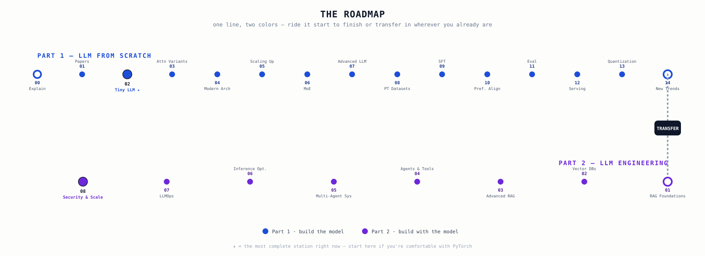
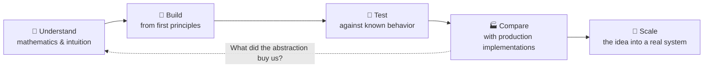
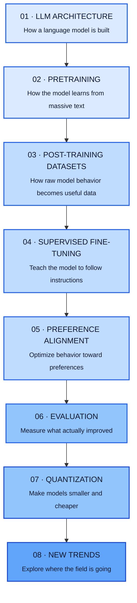

<p align="center">
  
</p>

<p align="center">
  <a href="./ROADMAP.md">
    
  </a>
  
  
  <a href="./LICENSE">
    
  </a>
</p>

<p align="center">
  <strong>Build the model. Understand the mathematics. Reproduce the systems. Then use the abstractions.</strong>
</p>

<p align="center">
  An open, implementation-first learning path for understanding Large Language Models from tensors and attention
  all the way through pretraining, post-training, alignment, evaluation, quantization, and serving.
</p>

---

# 🧠 LLM From Scratch

> **A free, open learning resource for people who don't want to merely use LLMs — they want to understand how they work.**

Modern LLM development can feel like a wall of abstractions:

```text
transformers → Trainer → PEFT → TRL → vLLM → quantization → deployment
```

Those tools are incredibly useful when the goal is to **ship a product**.

But if the goal is to **understand the technology**, they can hide the most important question:

> **What is actually happening underneath the abstraction?**

This repository takes the opposite approach.

We start with the mathematical and computational foundations, implement important components ourselves, test them, and only then connect them to the libraries and systems used in production.

```text
UNDERSTAND
    ↓
IMPLEMENT
    ↓
TEST
    ↓
COMPARE WITH PRODUCTION
    ↓
SCALE
    ↓
TRAIN
    ↓
ALIGN
    ↓
EVALUATE
    ↓
QUANTIZE
    ↓
SERVE
```

The goal is not to build the biggest model.

**The goal is to make the entire LLM stack understandable.**

---

## 🌍 Why this resource exists

The LLM ecosystem moves incredibly fast.

A learner can easily jump from:

- "What is a Transformer?"
- to "How do I fine-tune Llama?"
- to "How do I deploy with vLLM?"

without ever developing a strong mental model of the machinery underneath.

That creates a dangerous gap:

**you can operate the tools without understanding the system.**

This project is designed to close that gap.

It is a public learning resource built around a simple principle:

> ### If a component is important enough to learn, build a small version of it before hiding it behind a library.

You will encounter the same idea repeatedly:



For example:

```text
Hand-rolled attention
        ↓
torch.nn.MultiheadAttention
        ↓
Understand the abstraction
        ↓
Understand the trade-offs
        ↓
Know when and why to use it
```

This philosophy applies throughout the repository.

---

# 🗺️ The LLM Mastery Path

The repository follows an eight-stage learning path.



### The important idea

The stages are not isolated topics.

They form a dependency chain:

```text
Architecture
     ↓
Pretraining
     ↓
Post-training data
     ↓
SFT
     ↓
Preference alignment
     ↓
Evaluation
     ↓
Quantization
     ↓
New research directions
```

If you understand the earlier layer, the later layer becomes easier to reason about.

If something near the top feels mysterious, **go back down the stack.**

---

# 🏗️ How the repository is organized

The repository contains **15 modules**, grouped around the eight-stage mastery path.

```mermaid
flowchart LR
    E["00 · Explanation"]
    P["01 · Papers"]

    T["02 · Tiny LLM"]
    AV["03 · Attention Variants"]
    MA["04 · Modern Architecture"]

    SU["05 · Scaling Up"]
    MOE["06 · Mixture of Experts"]
    ADV["07 · Advanced LLM"]

    PTD["08 · Post-Training Datasets"]
    SFT["09 · SFT"]
    PA["10 · Preference Alignment"]

    EV["11 · Evaluation"]
    SRV["12 · Serving"]
    Q["13 · Quantization"]
    NT["14 · New Trends"]

    E --> P --> T
    T --> AV --> MA --> SU
    SU --> MOE --> ADV --> PTD
    PTD --> SFT --> PA --> EV
    EV --> SRV --> Q --> NT

    NT -.-> P2["Part 2 · AI Engineering Roadmap"]
```



> **Note:** Serving sits alongside the core eight-stage learning path as the production bridge between understanding a model and actually putting it behind an interface. It is intentionally kept in the repository because a model is much more useful when you understand how it reaches a real user.

---

# 📚 What you will learn

## Stage 1 — LLM Architecture

**Question:** *What is actually inside a language model?*

You will build the foundations of a GPT-style Transformer:

- self-attention
- causal attention
- multi-head attention
- normalization
- feed-forward networks
- residual connections
- Transformer blocks
- token embeddings
- positional representations
- model configuration
- language-model heads
- autoregressive generation
- tokenization
- sampling

The first major milestone is a working GPT-style model built from the underlying components rather than importing a complete model class.

### Architecture progression

```text
Tokens
  ↓
Token Embeddings
  ↓
Positional Information
  ↓
Transformer Block × N
  ├── Normalization
  ├── Multi-Head Attention
  ├── Residual Connection
  ├── Normalization
  ├── Feed-Forward Network
  └── Residual Connection
  ↓
Final Normalization
  ↓
Language-Model Head
  ↓
Next-token probabilities
  ↓
Sampling
  ↓
Generated text
```

---

## Stage 2 — Pretraining

**Question:** *How does a model learn language from large-scale data?*

Topics include:

- data preparation
- training objectives
- training loops
- learning-rate scheduling
- mixed precision
- gradient accumulation
- distributed training
- DDP
- FSDP
- scaling laws
- monitoring
- mixture-of-experts
- routing
- load-balancing loss

The purpose is to move from:

> **"I built a Transformer."**

to:

> **"I understand how that Transformer becomes a pretrained model."**

---

## Stage 3 — Post-Training Datasets

**Question:** *How do we create useful data for teaching a pretrained model to follow instructions?*

Topics include:

- chat templates
- loss masking
- synthetic instruction generation
- self-instruct style data
- data enhancement
- paraphrasing
- difficulty variation
- quality filtering

This stage is deliberately treated as a first-class part of LLM development.

**Good post-training data is not an afterthought.**

---

## Stage 4 — Supervised Fine-Tuning

**Question:** *How do we teach the pretrained model to follow instructions?*

Topics include:

- prompt formatting
- response formatting
- loss masking
- supervised fine-tuning
- training scripts
- evaluation hooks
- checkpoint comparison

The conceptual transition is:

```text
Pretrained model
      ↓
Instruction dataset
      ↓
Supervised training
      ↓
Instruction-following model
```

---

## Stage 5 — Preference Alignment

**Question:** *How do we make model behavior better according to human or preference signals?*

Topics include:

- preference datasets
- reward models
- rejection sampling
- Direct Preference Optimization (DPO)
- Proximal Policy Optimization (PPO)
- rollout collection
- PPO vs DPO

The goal is to understand not just **how** these methods are used, but the optimization problem they are trying to solve.

---

## Stage 6 — Evaluation

**Question:** *How do we know whether the model actually improved?*

Topics include:

- automated benchmarks
- perplexity
- multiple-choice evaluation
- human A/B evaluation
- model-based evaluation
- LLM-as-judge
- feedback aggregation
- checkpoint comparison

A model that produces impressive examples is not necessarily a better model.

Evaluation turns:

```text
"It feels better."
```

into:

```text
"Here is the evidence."
```

---

## Stage 7 — Quantization

**Question:** *How can we reduce model memory and inference cost while preserving useful quality?*

Topics include:

- symmetric quantization
- asymmetric quantization
- per-tensor quantization
- per-channel quantization
- block-wise quantization
- GGUF / llama.cpp
- GPTQ
- AWQ
- SmoothQuant
- ZeroQuant

The learning path starts with the mathematics of quantization before moving toward practical model formats and tooling.

---

## Stage 8 — New Trends

**Question:** *What directions are extending the capabilities of modern models?*

Topics include:

- model merging
- task arithmetic
- multimodal models
- interpretability
- attention visualization
- logit lens
- test-time compute
- self-consistency
- best-of-N
- tree-search-style reasoning

This section is intentionally open-ended.

The field will continue to change.

The purpose is to build the foundations required to **understand new ideas when they appear**, rather than memorize today's techniques.

---

# 🔬 The "from scratch" philosophy

This repository is not trying to replace production libraries.

It is trying to make you **dangerously comfortable with what those libraries are doing for you.**

The learning cycle is:

| Step | Goal |
|---|---|
| 📖 Read | Understand the idea and mathematics |
| 🧠 Explain | Describe it without code |
| 🔨 Implement | Build a minimal version yourself |
| 🧪 Test | Verify behavior numerically |
| 🔍 Inspect | Look at tensors, shapes, gradients and outputs |
| 🏭 Compare | Compare against established implementations |
| ⚡ Optimize | Understand what production systems change |
| 🚀 Integrate | Put the component into the larger model |

This is why a small implementation can be more educational than immediately training a billion-parameter model.

---

# 🧩 Module map

<details>
<summary><strong>00 · Explanation</strong></summary>

Conceptual write-ups covering attention, normalization, training objectives and the "why" behind the implementations that follow.

</details>

<details>
<summary><strong>01 · Papers</strong></summary>

An annotated reading list for the research papers referenced throughout the project.

</details>

<details>
<summary><strong>02 · Tiny LLM</strong> — Stage 1</summary>

The first complete GPT-style implementation.

It covers data loading, multiple tokenization approaches, BPE, attention, normalization, Transformer blocks, configuration, model assembly, causal-language-model wrapping, training, pretrained GPT-2 weight loading, decoding, classification fine-tuning and testing.

See [`02_tiny_llm/README.md`](./02_tiny_llm/README.md).

</details>

<details>
<summary><strong>03 · Attention Variants</strong></summary>

A comparative study of self-attention, causal attention, MHA, GQA, MQA, sliding-window attention and additional variants, with benchmarking and visualization planned around the implementations.

</details>

<details>
<summary><strong>04 · Modern Architecture</strong></summary>

RoPE, NoPE, RMSNorm, SwiGLU, KV-cache, sliding-window attention and rolling-buffer KV-cache, followed by ablation notes on the impact of architectural changes.

</details>

<details>
<summary><strong>05 · Scaling Up</strong> — Stage 2</summary>

Mixed precision, gradient accumulation, distributed training with DDP/FSDP, scaling-law notes, data preparation and experiment monitoring.

</details>

<details>
<summary><strong>06 · Mixture of Experts</strong></summary>

MoE layers, routers and load-balancing objectives.

</details>

<details>
<summary><strong>07 · Advanced LLM From Scratch</strong></summary>

Combines modern components into a more capable architecture:

`RoPE + RMSNorm + SwiGLU + GQA + KV-cache + optional MoE`

</details>

<details>
<summary><strong>08 · Post-Training Datasets</strong> — Stage 3</summary>

Chat templates, loss masking, synthetic data generation, data enhancement and quality filtering.

</details>

<details>
<summary><strong>09 · Instruction Fine-Tuning / SFT</strong> — Stage 4</summary>

Instruction formatting, loss masking, SFT training and evaluation integration.

</details>

<details>
<summary><strong>10 · Preference Alignment</strong> — Stage 5</summary>

Reward modeling, preference data, rejection sampling, DPO and PPO.

</details>

<details>
<summary><strong>11 · Evaluation</strong> — Stage 6</summary>

Automated benchmarks, human evaluation, model-based evaluation and feedback aggregation.

</details>

<details>
<summary><strong>12 · Serving</strong> — Production Bridge</summary>

FastAPI inference, batching, streaming, vLLM, GGUF/Ollama, Baseten and load testing.

</details>

<details>
<summary><strong>13 · Quantization</strong> — Stage 7</summary>

Quantization fundamentals, GGUF/llama.cpp, GPTQ/AWQ and activation-aware methods such as SmoothQuant and ZeroQuant.

</details>

<details>
<summary><strong>14 · New Trends</strong> — Stage 8</summary>

Model merging, multimodal extensions, interpretability and test-time compute.

</details>

---

# 🧪 Current implementation status

The detailed, continuously updated status lives in [`ROADMAP.md`](./ROADMAP.md).

### Legend

| Symbol | Meaning |
|---|---|
| ✅ | Complete |
| 🚧 | In progress |
| ⬚ | Planned |

The roadmap intentionally distinguishes between:

- a written explanation
- a scaffold/skeleton
- an implementation
- tests
- a verified end-to-end result

**A file existing in the repository does not automatically mean the concept is complete.**

That distinction matters for a learning resource.

---

# 🛣️ Recommended learning routes

## Route A — You already know PyTorch

Start here:

```text
02_tiny_llm
      ↓
03_attention_variants
      ↓
04_modern_architecture
      ↓
05_scaling_up
      ↓
06_mixture_of_experts
      ↓
07_advanced_llm
      ↓
08_post_training_datasets
      ↓
09_sft
      ↓
10_preference_alignment
      ↓
11_evaluation
      ↓
12_serving
      ↓
13_quantization
      ↓
14_new_trends
```

## Route B — You are still learning PyTorch

Start with:

[`extra/pytorch-basics/pytorch_nn_cnn_transformer_from_scratch.ipynb`](./extra/pytorch-basics/pytorch_nn_cnn_transformer_from_scratch.ipynb)

It is the intended on-ramp for:

```text
Tensors
  ↓
Autograd
  ↓
Neural networks
  ↓
CNNs
  ↓
Transformer components
  ↓
LLM architecture
```

Then enter the main roadmap at `02_tiny_llm`.

---

# 🏆 Major milestones

The project is designed around progressively stronger milestones.

### Milestone 1 — Understand the Transformer

You can explain:

- why attention exists
- how Q, K and V interact
- why causal masking is needed
- how multi-head attention works
- why normalization and residual connections matter
- how a Transformer block fits together

### Milestone 2 — Build a tiny GPT

You can implement and train a small autoregressive language model and generate text from it.

### Milestone 3 — Reproduce a known architecture

You can load and verify pretrained GPT-2 weights in the from-scratch architecture.

### Milestone 4 — Modernize the architecture

You understand and can implement components such as:

```text
RoPE
RMSNorm
SwiGLU
GQA
KV-cache
MoE
```

### Milestone 5 — Understand post-training

You can follow the journey:

```text
Pretrained model
      ↓
Post-training dataset
      ↓
SFT
      ↓
Preference data
      ↓
DPO / PPO / reward modeling
      ↓
Aligned model
```

### Milestone 6 — Measure it

You can evaluate the model with automated, human and model-based signals.

### Milestone 7 — Make it cheaper

You understand how quantization changes:

```text
precision → memory → throughput → latency → quality
```

### Milestone 8 — Put it in production

You can connect the model to an inference API and production-oriented serving tools.

---

# 🏭 Production bridge

Understanding the implementation is only half the journey.

The repository deliberately moves between:

```text
FIRST PRINCIPLES
      │
      ├── raw PyTorch tensors
      ├── explicit equations
      ├── small experiments
      └── tests
             │
             ▼
PRODUCTION ABSTRACTIONS
      │
      ├── Hugging Face
      ├── TRL
      ├── vLLM
      ├── GGUF / llama.cpp
      └── deployment infrastructure
```

The question is not:

> "Should I use libraries?"

**Of course you should.**

The better question is:

> **"Do I understand what the library is doing well enough to use it intelligently?"**

---

# 📊 Experimentation and reproducibility

Training experiments are tracked with MLflow.

```bash
mlflow ui --backend-store-uri ./experiments/mlruns
```

Tests can be run with:

```bash
pytest -v
```

The repository also keeps model checkpoints separate from the source tree.

See [`checkpoints/README.md`](./checkpoints/README.md) for the checkpoint workflow.

---

# ⚙️ Environment

## Python environment

```bash
python -m venv .venv
```

Activate it according to your operating system, then:

```bash
pip install -r requirements.txt
```

## Docker

```bash
docker build -t llm-from-scratch .
docker run --gpus all -it llm-from-scratch
```

---

# 📦 Data

The repository includes a data-collection track for building pretraining material.

The current books module covers sources including:

- Project Gutenberg
- Internet Archive
- Wikipedia

Data collection is treated as part of the learning process because model quality begins long before the first training step.

```text
SOURCE
  ↓
COLLECT
  ↓
CLEAN
  ↓
FILTER
  ↓
DEDUPLICATE
  ↓
TOKENIZE
  ↓
PACK
  ↓
TRAIN
```

---

# 🧭 A note on scale

You do **not** need a massive GPU cluster to learn LLM engineering.

This repository intentionally starts small.

A tiny model can teach you:

- tensor shapes
- attention
- gradients
- loss
- optimization
- tokenization
- sampling
- caching
- quantization

The same principles eventually appear in much larger systems.

The scale changes.

**The underlying ideas do not disappear.**

---

# 📖 How to study each module

Do not treat this repository like a collection of files to finish.

Use each module as a mini research project.

### 1. Read the explanation

Understand the problem before looking at the implementation.

### 2. Write the mathematics

If the component has an equation, derive it.

For example, attention should eventually become something you can write yourself:

```text
Attention(Q, K, V)
    = softmax(QKᵀ / √dₖ)V
```

### 3. Trace the tensors

For every major operation, ask:

```text
What is the shape?
Why is it this shape?
What does each dimension represent?
```

### 4. Implement the smallest working version

Avoid optimization initially.

Make the mechanism obvious.

### 5. Test it

Use:

- shape tests
- numerical checks
- edge cases
- reference comparisons
- gradient checks where appropriate

### 6. Compare with the production implementation

Only after understanding the simple version.

Ask:

> What did the production implementation optimize?

That question is often where the real engineering lesson begins.

---

# 🤝 Contributing

This is intended to be a **public learning resource**.

If you find:

- an incorrect explanation
- a mathematical mistake
- a broken implementation
- a missing test
- a clearer way to explain a concept
- a useful paper
- a reproducibility issue
- a better visualization

please open an issue or pull request.

See [`CONTRIBUTING.md`](./CONTRIBUTING.md).

### Good contributions are:

```text
Correct
   +
Reproducible
   +
Well-tested
   +
Clearly explained
   +
Useful to another learner
```

Notebooks should run top-to-bottom without manual patching, and outputs should be stripped before committing.

---

# 🌱 The bigger vision

This repository is more than a collection of implementations.

It is an attempt to build a **free, structured path into LLM engineering** that does not require someone to already know the entire ecosystem.

The long-term idea is simple:

> **Turn the LLM stack from a black box into a sequence of understandable problems.**

Instead of asking:

> "Which framework should I learn?"

you should eventually be able to ask:

> "What problem is this framework solving, what abstraction does it provide, and what is happening underneath it?"

That is a much more durable skill.

---

# 🚀 Beyond this repository

This project is **Part 1** of a broader learning path.

Once a model exists, the next layer is AI engineering:

```text
LLM
 ↓
Inference
 ↓
RAG
 ↓
Agents
 ↓
Tool use
 ↓
Inference optimization
 ↓
Evaluation in applications
 ↓
Production deployment
```

Part 2 — [`AI-EngineeringRoadmap`](../AI-EngineeringRoadmap) — continues from the model itself into the systems built around it.

---

# 📌 Quick start

```bash
git clone <your-repository-url>
cd <your-repository>

python -m venv .venv
pip install -r requirements.txt

pytest -v
```

Then start learning:

```text
extra/pytorch-basics/
        ↓
02_tiny_llm/
        ↓
03_attention_variants/
        ↓
04_modern_architecture/
        ↓
...
```

For detailed progress:

**→ [`ROADMAP.md`](./ROADMAP.md)**

---

# ⭐ If this resource helps you

This project is being built as a free resource so that the knowledge is accessible to anyone willing to learn.

If it helps you understand something that previously felt impossible:

- ⭐ Star the repository
- 🐛 Report issues
- 💡 Suggest improvements
- 🔬 Reproduce the experiments
- 🤝 Contribute explanations or implementations
- 📢 Share it with another learner

The most valuable outcome is not the star count.

**It is another person who can now explain how an LLM works.**

---

## License

See [`LICENSE`](./LICENSE).
